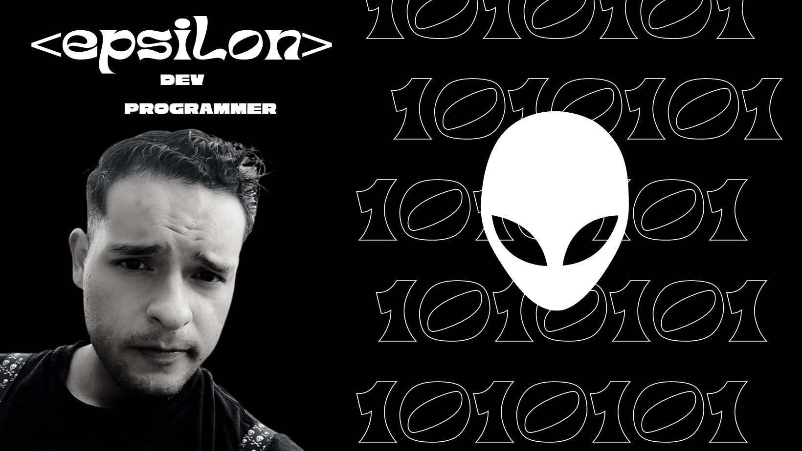

    

    

        
    

    

  
  
   

    
    

    <h1> 👽  HI THERE  👽</h1>

    <h2> 🛸 ABOUT ME : </h2>

    - 🪐 I enjoy working in a team, facing challenges, and finding innovative solutions to difficult problems. My technical skills in computer science and         
    my ability to think creatively make me a valuable contributor to any project. I'm excited to continue learning and growing as a professional.

 <h2> 🚀 Languages and Tools </h2>
  
  
  
  
  
  
  
  
  
  
  

  
  
  
  
  
  
  
  

    <h2> 🔭 My Stats : </h2>

    

    

